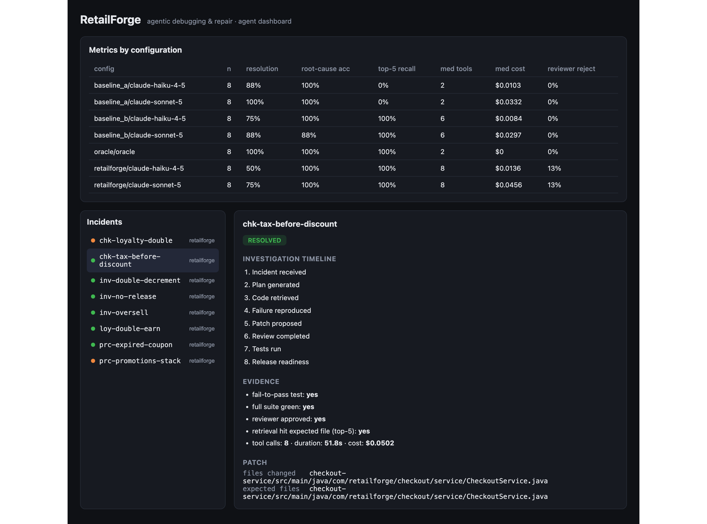
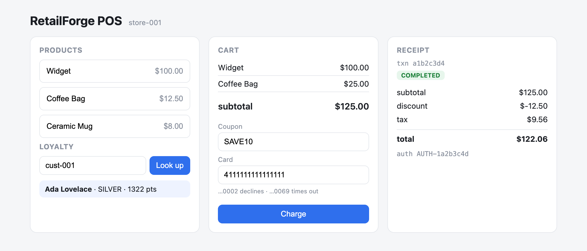

# RetailForge

RetailForge is two things in one repo. The first is a small but believable retail backend built the way a real point of sale system is built, as a set of Spring Boot microservices with their own databases and an event bus. The second is a multi-agent system that debugs that backend. You hand it a bug report, and it retrieves the relevant code, reproduces the failure, writes a regression test, proposes a patch, has a separate agent review the patch, and only calls it fixed when the tests actually pass.

The interesting part is not "an AI that writes code from a prompt." It is a system that works across a repository, APIs, logs, a test runner, and real service boundaries, and that refuses to trust its own fix until a deterministic check confirms it.



## why I built it this way

I wanted a project that looks like the actual job of maintaining retail software: point of sale, pricing and promotions, loyalty, inventory, payments, and the messy distributed-systems bugs that show up when those services talk to each other over events. So the bugs here are not generic null-pointer toys. They are things like loyalty points getting awarded twice after a checkout retry, tax getting computed before a discount, a duplicated Kafka event decrementing stock twice, or a cancelled order never releasing its reservation.

That domain is also the point of the research angle below.

## the two halves

### the retail platform (the system under test)

Six Maven modules under `services/`, Java 17 and Spring Boot 3.3:

- `checkout-service` carts, checkout, payment retries, the transaction lifecycle, event publishing
- `pricing-service` base prices, percentage and buy-one-get-one promotions, coupon validation, a price cache
- `loyalty-service` points earn and redeem, tiers, an idempotent ledger
- `inventory-service` reserve, release, and commit stock, with oversell protection
- `payment-simulator` deterministic approve, decline, and timeout outcomes
- `common` the shared event abstraction and money helpers

Everything talks REST with Swagger, uses Postgres at runtime and H2 in tests, and publishes domain events through an `EventPublisher` seam (in memory for tests, Kafka or Redpanda for the running system). All six modules build and their 19 tests pass.

Here is the React POS that drives real transactions against those services:



### the agent platform

Python, under `agent-platform/`. The investigation runs as a small state machine (a LangGraph-style graph kept in-repo so there is no heavy dependency) with these steps:

`intake` structures the report, `planner` lays out the investigation, `retriever` does hybrid BM25 and semantic search over method-level code chunks, `reproducer` runs the failing test, `repair` proposes a minimal patch from the evidence, an independent `reviewer` judges that patch (never the same agent that wrote it), and `verify` applies the change and runs the test plus the full suite. If the reviewer rejects, the repair gets one more attempt.

The agent only ever touches the world through a controlled tool layer (`search_code`, `read_file`, `write_file`, `run_tests`), so every action is typed and counted. It is backed by the Anthropic API with a mock provider for offline dry runs.

## the actual experiment

The engineering is the portfolio piece. The research question is an ablation: which parts of the pipeline actually move the needle, and does deterministic verification (a failing test before the patch, plus an independent reviewer) reduce false fixes? I compare three configurations on the same benchmark:

- **baseline_a** one model, the whole affected service in context, no retrieval, no reproduction, no review
- **baseline_b** retrieval plus a single repair attempt, but no execution and no review
- **retailforge** the full pipeline above

There is also an **oracle** config that feeds the known-good fix, which exists to prove the scorer itself is correct.

## the benchmark

I use a controlled-injection model instead of hoping for realistic bugs. The base code is correct and its tests pass. Each incident (`incidents/definitions/*.json`) carries an exact source mutation that introduces one bug, the test that should catch it, the expected root cause, and the file that should change. Applying the mutation is the bug, reversing it is the golden fix.

There are 8 incidents today across checkout, loyalty, pricing, and inventory, including the distributed-systems ones. A validation script confirms every one of them reproduces deterministically: the target test fails with the bug applied and passes with it reverted. Adding more is just dropping in another JSON file.

## what the current run shows

I ran the full matrix for real across two models (claude-sonnet-5 and claude-haiku-4-5), all 8 incidents, one repeat each, about $1.60 total. Here is end-to-end resolution (verified, no human) by configuration:

| config | sonnet-5 | haiku-4-5 |
| --- | --- | --- |
| baseline_a (single shot, whole file in context) | 100% | 88% |
| baseline_b (retrieval + one repair) | 88% | 75% |
| retailforge (full pipeline) | 75% | 50% |
| oracle (ceiling) | 100% | n/a |

The honest headline is that the simplest baseline won. A single model with the whole affected file pasted into context resolved all 8. The full pipeline resolved 6. Two reasons, and I am not going to spin them:

1. The benchmark is too easy for the pipeline to earn its keep. These bugs are localized and the services are small enough that the whole file fits in the prompt, so retrieval and reproduction add nothing the model did not already have. Retrieval only starts to matter when the codebase is too big to fit in context, which mine is not yet.
2. The independent reviewer cost me a resolution. The pipeline produced a correct, passing patch for `prc-promotions-stack` and the reviewer rejected it anyway. Verification is not free when the reviewer is imperfect.

So the real result is not "multi-agent beats single-shot." It is that on small localized bugs, full-context single-shot is already at 100%, the multi-agent pipeline sits at 75% and runs about 2.4x slower, and deterministic review introduced one false rejection. That is a more interesting finding than a rigged win, and it points straight at the next step: make the benchmark hard in the ways that break single-shot, meaning bugs that span multiple files, repos too large to fit in context, and incidents where a wrong fix is expensive so verification pays off.

What is solid regardless of config: retrieval put the right file in the top 5 every time it was used (100%), root-cause identification was 100% on the pipeline, reproduction was 100%, and the oracle confirms the scorer is sound. The machinery is real. The benchmark just needs to get harder before the pipeline can prove its point.

### full metrics, retailforge with claude-sonnet-5

| metric | value |
| --- | --- |
| scope | 6 modules (5 services + shared lib), 79 files, 257 code chunks |
| benchmark | 8 seeded incidents |
| diagnosis (root cause) | 100% |
| retrieval (top-5) | 100% |
| reproduction | 100% |
| patching (compiled + all tests pass) | 88% |
| end-to-end (resolved, no human) | 75% |
| speed (median to verified patch) | 46s |
| efficiency | 7.4 tool calls, 4.2 model calls per incident |
| reliability | 12.5% reviewer rejection, 12.5% unsupported answers |
| scale | 48 agent runs completed |

## running it

You need Java 17+, Maven, Node, Python 3.10+, and Docker for the running system.

```bash
# build and test the retail backend
mvn -f services/pom.xml install

# bring up postgres, redis, redpanda
docker compose -f infrastructure/docker-compose.yml up -d
bash infrastructure/run-services.sh          # all five services, distributed profile

# the agent side (offline, no key needed)
cd agent-platform && pip install -e .
python scripts/validate_incidents.py         # every incident reproduces
python evaluation/run_eval.py --configs oracle          # the scorer self-test
python evaluation/run_eval.py \
  --configs baseline_a,baseline_b,retailforge,oracle \
  --provider mock --models mock                          # the full free matrix

# a real run (costs a little)
export ANTHROPIC_API_KEY=...
python -m retailforge.run chk-loyalty-double --config retailforge --model claude-haiku-4-5

# the frontends
cd apps/pos-web && npm install && npm run dev            # POS on :5173
cd apps/agent-dashboard && npm install && npm run dev    # dashboard on :5174
```

The dashboard reads `apps/agent-dashboard/public/results.json`, so copy the output of any eval run there to see it visualized.

## repo layout

```
services/         six spring boot modules (the system under test)
incidents/        controlled-injection bug definitions
agent-platform/   the agent graph, retrieval, tools, and eval harness
apps/pos-web      react point of sale
apps/agent-dashboard  react dashboard for investigations and metrics
infrastructure/   docker compose and a local run script
```

## status

The backend, the benchmark, the agent pipeline, the evaluation harness, and both frontends are built and verified. The retail tests pass, all 8 incidents reproduce, the scorer is proven with the oracle, and the full ablation has been run for real across two models. The next steps are the ones the results point to: make the benchmark harder (multi-file bugs, repos that do not fit in context, costly-error incidents so verification pays off), tune the reviewer so it stops rejecting correct patches, add a real test-generation step, and do the literature and novelty check. This is a work in progress, but the machinery is real, it runs, and the numbers are honest.
